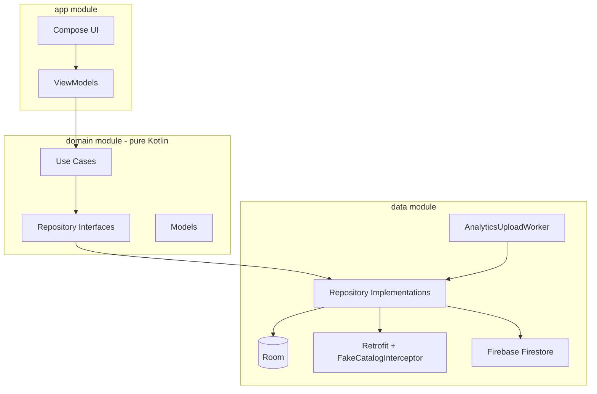

# FlashPool

## 1. Overview

FlashPool is an Android marketplace feed app that shows a cached product catalog, a time-limited flash deal, and local interaction logging synced to the cloud in the background. It is built for shoppers browsing deals offline or on poor networks, and for reviewers evaluating offline-first architecture, Compose UI, and background sync patterns in a single-screen app.

---

## 2. Tech Stack

| Technology | Role in this project |
|------------|----------------------|
| Kotlin 2.0.21 | Primary language across all modules |
| Kotlin Coroutines + Flow | Async work, Room `Flow` emissions, countdown ticks, ViewModel state |
| Jetpack Compose + Material 3 | Entire UI (`ProductFeedScreen`, `TicketStubFeaturedCard`, `ThemePickerSheet`, etc.) |
| Hilt 2.52 | DI for ViewModels, repositories, use cases, `AnalyticsUploadWorker` |
| Hilt Navigation Compose | `hiltViewModel()` in `FlashPoolAppRoot` and `ProductFeedScreen` |
| Hilt Work | `@HiltWorker` injection into `AnalyticsUploadWorker` |
| Room 2.6.1 | Local `products` and `analytics_log` tables; UI reads catalog via DAO `Flow` |
| Retrofit 2.11.0 + OkHttp 4.12.0 | HTTP client for catalog refresh (short-circuited by `FakeCatalogInterceptor`) |
| KotlinX Serialization 1.7.3 | JSON parsing for `mock_products.json` DTOs |
| WorkManager 2.9.1 | Periodic upload of unsynced analytics rows |
| Firebase Firestore (BOM 33.7.0) | Remote destination for analytics events (`analytics_log` collection) |
| Google Services Gradle plugin 4.4.2 | Wires `google-services.json` into the `app` module at build time |
| Coil 2.7.0 | Product images in `ProductCard` and `TicketStubFeaturedCard` |
| DataStore Preferences 1.1.1 | Persists light / dark / system theme choice |
| KSP 2.0.21 | Room and Hilt code generation |
| JUnit 4, Turbine, MockK, Robolectric | Unit tests for domain, data, and ViewModel layers |

---

## 3. Architecture

FlashPool uses three Gradle modules with strict dependency direction: `app` depends on `data` and `domain`; `data` depends on `domain`; `domain` has no Android, Room, Retrofit, or Firebase imports.

**Presentation** (`app`): Compose screens, `ProductFeedViewModel`, `ThemeViewModel`, theme tokens, and Hilt `DomainModule`.

**Domain** (`domain`): `Product`, `InteractionEvent`, `AppTheme`, repository interfaces (`ProductRepository`, `AnalyticsRepository`, `ThemePreferenceRepository`, `AnalyticsRemoteSync`), and use cases (`ObserveProductsUseCase`, `RefreshCatalogUseCase`, `CountdownTicker`, etc.).

**Data** (`data`): Room (`FlashPoolDatabase`, `ProductDao`, `AnalyticsDao`), Retrofit (`CatalogApi`, `FakeCatalogInterceptor`), repository implementations, `FirebaseAnalyticsRemoteSync`, `ThemePreferenceRepositoryImpl`, and `AnalyticsUploadWorker`.

ViewModels call use cases only, never repositories directly. Repository implementations switch to `Dispatchers.IO` before touching Room, the network, or Firestore.

### Package tree (from actual source layout)

```
app/src/main/kotlin/com/flashpool/
├── FlashPoolApp.kt
├── MainActivity.kt
├── di/
│   └── DomainModule.kt
└── ui/
    ├── FlashPoolAppRoot.kt
    ├── components/
    │   ├── CategoryFilterRow.kt
    │   ├── ErrorBanner.kt
    │   ├── FlashPoolTopBar.kt
    │   ├── ProductCard.kt
    │   ├── Shimmer.kt
    │   ├── ThemePickerSheet.kt
    │   ├── TicketPerforation.kt
    │   └── TicketStubFeaturedCard.kt
    ├── feed/
    │   ├── ProductFeedContract.kt
    │   ├── ProductFeedScreen.kt
    │   └── ProductFeedViewModel.kt
    ├── theme/
    │   ├── Color.kt
    │   ├── FontProvider.kt
    │   ├── Theme.kt
    │   ├── ThemeViewModel.kt
    │   └── Typography.kt
    └── util/
        └── CurrencyFormat.kt

domain/src/main/kotlin/com/flashpool/
├── model/
│   ├── AnalyticsEventPayload.kt
│   ├── AppTheme.kt
│   ├── InteractionEvent.kt
│   └── Product.kt
├── repository/
│   ├── AnalyticsRemoteSync.kt
│   ├── Repositories.kt
│   └── ThemePreferenceRepository.kt
└── usecase/
    ├── ThemeUseCases.kt
    └── UseCases.kt

data/src/main/kotlin/com/flashpool/data/
├── di/
│   ├── DataModule.kt
│   └── FirebaseModule.kt
├── firebase/
│   └── FirebaseAnalyticsRemoteSync.kt
├── local/
│   ├── DatabaseMigrations.kt
│   ├── FlashPoolDatabase.kt
│   ├── dao/Daos.kt
│   └── entity/Entities.kt
├── mapper/Mappers.kt
├── preferences/ThemePreferenceRepositoryImpl.kt
├── remote/
│   ├── CatalogApi.kt
│   ├── FakeCatalogInterceptor.kt
│   └── dto/Dtos.kt
├── repository/
│   ├── AnalyticsRepositoryImpl.kt
│   └── ProductRepositoryImpl.kt
└── worker/AnalyticsUploadWorker.kt
```

### Dependency diagram



---

## 4. Feature Breakdown

### 4.1 Product Feed (Offline-First + Remote Sync)

**What the UI reads:** `ProductFeedViewModel` subscribes to `ObserveProductsUseCase`, which wraps `ProductRepository.observeCatalog()`. That method returns a Room `Flow` from `ProductDao.observeAll()` (Home tab) or `ProductDao.observeByCategory()` (FMCG, Lifestyle, Tech). The UI never calls Retrofit or Firestore directly.

**How data gets into Room:**

1. On init, `ProductFeedViewModel` fires `ProductFeedEvent.Refresh`.
2. `RefreshCatalogUseCase` calls `ProductRepositoryImpl.refreshCatalog()`.
3. `CatalogApi.getProducts()` is intercepted by `FakeCatalogInterceptor`, which reads `data/src/main/assets/mock_products.json` after an 800 ms simulated delay.
4. DTOs are mapped to `ProductEntity` rows. The flash deal (`flash-deal-1`) gets `dealEndEpochMillis = now + 2 hours` on each refresh (`ProductRepositoryImpl.FLASH_DEAL_DURATION_MS`).
5. `ProductDao.upsertAll()` writes into the `products` table. The DAO `Flow` re-emits and the feed updates.

**Cold start with cache:** If Room already has rows, `ProductDao` emits them immediately while refresh runs. Shimmer shows only when `items` is empty.

**Refresh failure:** `refreshCatalog()` returns `Result.failure`. `ProductFeedViewModel` sets `error` on `ProductFeedUiState` but does not clear `items`. `ErrorBanner` appears above the list; cached products stay visible.

**Pull to refresh:** `PullToRefreshBox` in `ProductFeedScreen` sets `isRefreshing = true` when items already exist, so the full-screen shimmer is not shown again.

**What Firestore actually does:** Firestore is **not** a second product catalog source. It does **not** mirror products for cross-device sync. Firestore receives **analytics events only** — rows from the local `analytics_log` table uploaded by `FirebaseAnalyticsRemoteSync` into the `analytics_log` Firestore collection. Product data flows: `mock_products.json` → Retrofit → Room → UI. Analytics data flows: user action → Room `analytics_log` → WorkManager → Firestore.

**Why Room stays the single source of truth for the UI:** The feed screen always collects a Room `Flow`. Network refresh is a write path into Room, not a direct UI data path. Firestore is an outbound sync target for analytics, not an inbound catalog source. This keeps the feed fast, offline-capable, and independent of Firebase connectivity.

**Category filter:** `CategoryFilterRow` shows Home, FMCG, Lifestyle, Tech in a segmented pill bar. Home (`selectedCategory == null`) is leftmost and selected by default. `TicketStubFeaturedCard` renders only on Home. Switching tabs resets scroll to the top via `key(state.selectedCategory)` and `LaunchedEffect` in `ProductFeedScreen`.

### 4.2 Flash Deal Countdown

The flash deal is product `flash-deal-1` from `mock_products.json`. On each catalog refresh, `ProductRepositoryImpl` stamps its end time as two hours from refresh.

`CountdownTicker` in `domain/usecase/UseCases.kt` exposes a cold `flow { }` that every second emits:

```
remaining = (endEpochMillis - now()).coerceAtLeast(0)
```

Each tick recomputes from the absolute end instant instead of decrementing a counter. That self-corrects if the coroutine wakes late, the device clock jumps, or the app was briefly suspended.

`ProductFeedViewModel.startCountdown()` launches the flow in `viewModelScope`. The previous `countdownJob` is cancelled before starting a new one. Remaining time is written to `ProductFeedUiState.flashDealRemainingMillis`. `TicketStubFeaturedCard` reads it via `collectAsStateWithLifecycle()` and hides itself when remaining reaches zero.

**Configuration changes:** The `ViewModel` and `StateFlow` survive rotation; the countdown job is not restarted per recomposition.

**Process death:** `SavedStateHandle` stores `flash_deal_end_epoch`. On recreation, `init` reads that value and restarts the countdown. If the deal expired while the process was dead, remaining hits zero and the card hides.

### 4.3 Interaction Logging + Background Sync

**Event model:** `InteractionEvent` (sealed class in `domain/model/InteractionEvent.kt`) has `JoinPool`, `ShareLink`, and `CompletedCheckout`, each with `productId` and `timestampEpochMillis`.

**Local write:** `LogInteractionUseCase` → `AnalyticsRepositoryImpl.logEvent()` → `AnalyticsDao.insert()` into `analytics_log` with `synced = false`.

**WorkManager schedule:** `FlashPoolApp.scheduleAnalyticsUpload()` enqueues a unique periodic `AnalyticsUploadWorker`:

- Interval: 15 minutes (Android minimum for `PeriodicWorkRequest`)
- Constraints: `NetworkType.UNMETERED` and `requiresCharging(true)`
- Policy: `ExistingPeriodicWorkPolicy.KEEP`

**Upload path:** `AnalyticsUploadWorker.doWork()` → `AnalyticsRepository.uploadPendingEvents()` → reads unsynced rows via `AnalyticsDao.getUnsynced()` → maps to `AnalyticsEventPayload` → `FirebaseAnalyticsRemoteSync.uploadEvents()` writes a Firestore batch to collection `analytics_log` → on success, `AnalyticsDao.markSynced()` flips `synced = 1`. On failure, `Result.retry()` leaves rows unsynced for the next run.

**Why WorkManager + Firestore together (not Firestore offline persistence alone):** Analytics must be durable on device before upload. Room gives explicit local storage, queryable unsynced rows, and idempotent `markSynced` after confirmed upload. WorkManager provides OS-managed scheduling with network and charging constraints, backoff, and process-surviving retries. Firestore is the remote sink, not the local queue. This separates concerns: Room owns the offline queue; WorkManager owns when to sync; Firestore owns remote storage.

**Logging tags for debugging:** `AnalyticsUploadWorker`, `AnalyticsRepository`, `FlashPoolFirebaseSync`, `FlashPoolApp`.

### 4.4 Theme System (Light / Dark / System)

Theme preference is stored in Preferences DataStore (`theme_preferences`) via `ThemePreferenceRepositoryImpl` (`data/preferences/ThemePreferenceRepositoryImpl.kt`). Key: `app_theme` string (`LIGHT`, `DARK`, `SYSTEM`).

`ThemeViewModel` exposes `StateFlow<AppTheme>` from `ObserveThemePreferenceUseCase`. Writes go through `SetThemePreferenceUseCase`.

`FlashPoolAppRoot` collects the preference with `collectAsStateWithLifecycle()`, calls `resolveDarkTheme(appTheme, isSystemInDarkTheme())` from `domain/model/AppTheme.kt`, and passes the result to `FlashPoolTheme`. In `SYSTEM` mode, `isSystemInDarkTheme()` is read on every recomposition, so a device-wide theme change while the app is foregrounded updates immediately. `FlashPoolTheme` uses `Crossfade` and `animateColorAsState` for transitions.

`ThemePickerSheet` is a `ModalBottomSheet` opened from `FlashPoolTopBar`.

---

## 5. State Management

`ProductFeedViewModel` uses an immutable `ProductFeedUiState` data class (`ProductFeedContract.kt`) exposed as `StateFlow` via `stateIn`-style `asStateFlow()`. User actions are `ProductFeedEvent` sealed types handled in `onEvent()`. One-off UI feedback uses `ProductFeedEffect.ShowMessage` emitted through `MutableSharedFlow` and collected in `ProductFeedScreen` to show a Snackbar.

`ThemeViewModel` exposes a simpler `StateFlow<AppTheme>` with no separate event type; `setTheme()` writes directly.

**Error handling (non-destructive):** On refresh failure, `ProductFeedViewModel.refresh()` sets `error` but does not clear `items`. `ProductFeedScreen` renders `ErrorBanner` above the list when `state.error != null`. Cached products remain visible and interactive. Retry dispatches `ProductFeedEvent.Retry`, which clears `error` at the start of the next refresh attempt.

**Loading states:** `isLoading` is true only when there is no cached data. `isRefreshing` is true during pull-to-refresh when items already exist.

---

## 6. Concurrency Notes

**Dispatchers.IO:** Used in `ProductRepositoryImpl`, `AnalyticsRepositoryImpl`, and `ThemePreferenceRepositoryImpl` via `withContext(ioDispatcher)`. Injected as `Dispatchers.IO` from `DataModule`.

**Main thread:** ViewModels collect Room `Flow` emissions and update `MutableStateFlow` on the coroutine context started in `viewModelScope` (Main by default). Compose reads state on the main thread via `collectAsStateWithLifecycle()`.

**ViewModel scope:** Product observation, refresh, analytics logging, and countdown collection all run in `viewModelScope`. `countdownJob` is cancelled in `startCountdown()` before launching a new ticker, preventing duplicate countdown flows.

**Firestore:** `FirebaseAnalyticsRemoteSync` uses `batch.commit().await()` (kotlinx-coroutines-play-services) inside a suspend function called from `withContext(ioDispatcher)`. No long-lived Firestore listener is registered; uploads are one-shot batch writes per worker run.

**WorkManager:** `AnalyticsUploadWorker` runs `doWork()` on a background thread provided by WorkManager; repository work inside uses `Dispatchers.IO`.

---

## 7. Testing

| Test file | What it covers |
|-----------|----------------|
| `domain/.../CountdownTickerTest.kt` | Tick math, zero completion, drift self-correction via injectable `nowMillis` |
| `domain/.../AppThemeTest.kt` | `resolveDarkTheme()` for LIGHT, DARK, SYSTEM |
| `data/.../ProductDaoTest.kt` | In-memory Room upsert and `observeAll()` (Robolectric) |
| `data/.../ThemePreferenceRepositoryImplTest.kt` | DataStore default (LIGHT) and persistence of all three themes |
| `app/.../ProductFeedViewModelTest.kt` | Refresh success/failure state, join-pool analytics logging (MockK + Turbine) |

**Not covered:** Compose UI snapshot tests, end-to-end WorkManager integration, full Retrofit stack, Firestore upload integration.

**Run all unit tests:**

```bash
./gradlew :domain:test :data:testDebugUnitTest :app:testDebugUnitTest
```

Robolectric tests in `data` require the Android SDK configured in `local.properties` (`sdk.dir=...`).

---

## 8. Setup and Run Instructions

### Clone

```bash
git clone https://github.com/Shashank9759/FlashPool-FunGames-Assignment.git
cd Funstop_Shashank_assign
```

### Firebase setup (`google-services.json`)

The `app` module applies the Google Services plugin and **requires** `app/google-services.json` to build. This file is listed in `.gitignore` and is intentionally not committed.

To build and run:

1. Create a Firebase project at [Firebase Console](https://console.firebase.google.com/).
2. Add an Android app with package name `com.flashpool`.
3. Download `google-services.json` and place it at `app/google-services.json`.
4. Enable **Cloud Firestore** and add security rules appropriate for your environment.
5. Add your debug SHA-1 fingerprint in Firebase project settings (run `./gradlew :app:signingReport`).

**Runtime behavior without Firestore connectivity:** The product feed works entirely from Room and does not depend on Firestore. If Firestore upload fails, analytics rows remain in Room with `synced = 0` and WorkManager retries on the next scheduled run. The app does not crash on sync failure.

**Build requirement:** There is no compile-time fallback without `google-services.json`. Reviewers must supply their own Firebase config file to assemble the `app` module.

### Android Studio

1. Open the project root in Android Studio (Ladybug or newer recommended).
2. Ensure `local.properties` exists with `sdk.dir` pointing at your Android SDK.
3. Sync Gradle.
4. Create or start an emulator (API 24+).
5. Run the `app` configuration.

**SDK versions** (from `app/build.gradle.kts`):

- `minSdk`: 24
- `targetSdk`: 35
- `compileSdk`: 35

### Build from command line

```bash
./gradlew :app:assembleDebug
```

---

## 9. Screenshots

### Light Mode


### Dark Mode


### WorkManager + Firestore Sync Demo


### Flash Deal Countdown (Close-up)


### Theme Picker


---

## 10. Screen Recordings

### Product Feed Demo (Offline-First Behavior)

https://github.com/user-attachments/assets/d66b2062-f288-4a29-84d1-a40ecbedc79c


---


## Appendix: Room Schema Export

Room exports schema version 1 to `data/schemas/com.flashpool.data.local.FlashPoolDatabase/1.json`. This file documents the `products` and `analytics_log` table structures for migration reference. It is generated at build time and is not read at runtime.

## Appendix: Mock Catalog

Product JSON lives at `data/src/main/assets/mock_products.json`. To point at a real API, replace `FakeCatalogInterceptor` or change the Retrofit `baseUrl` in `DataModule.provideCatalogApi()`.
